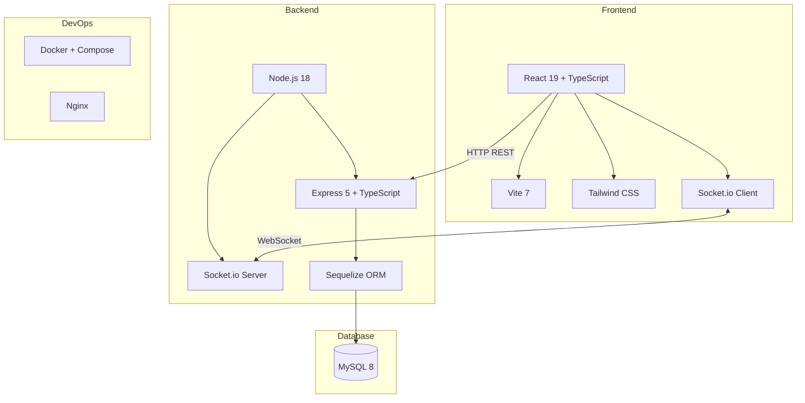
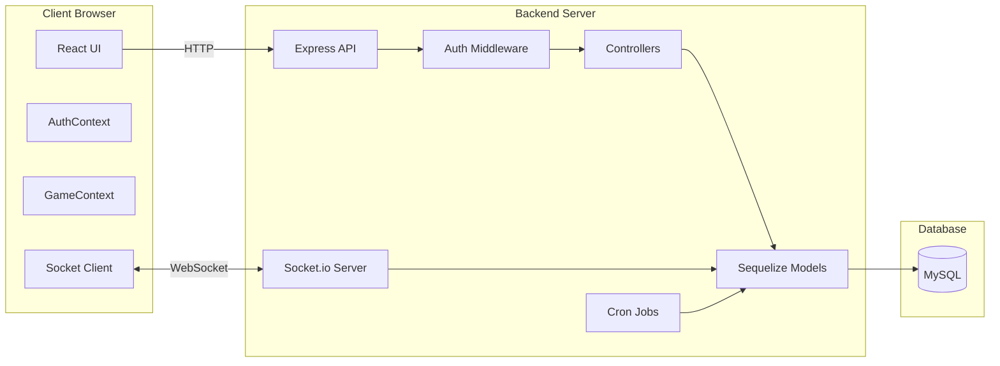
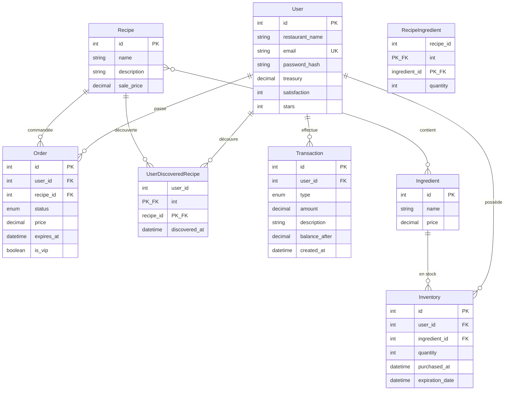
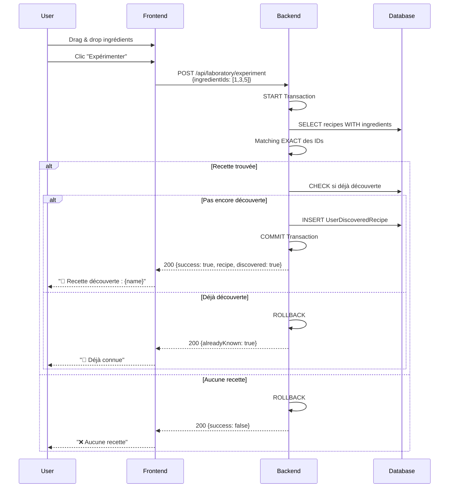
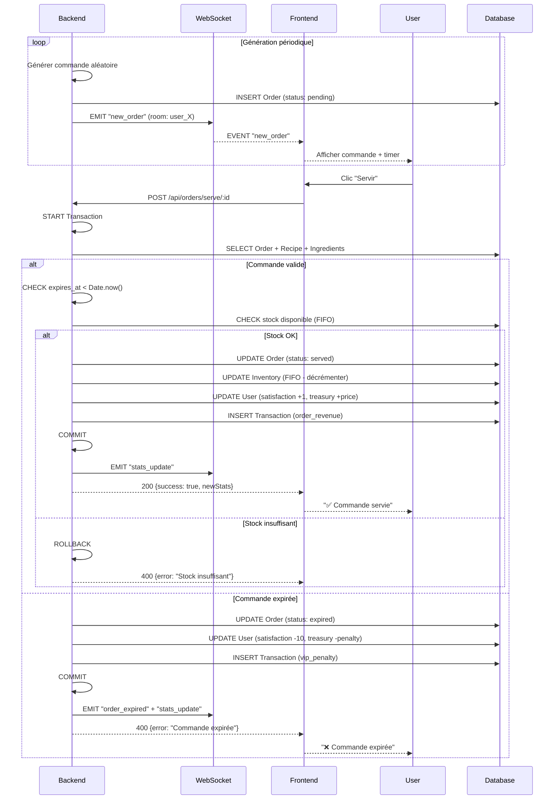
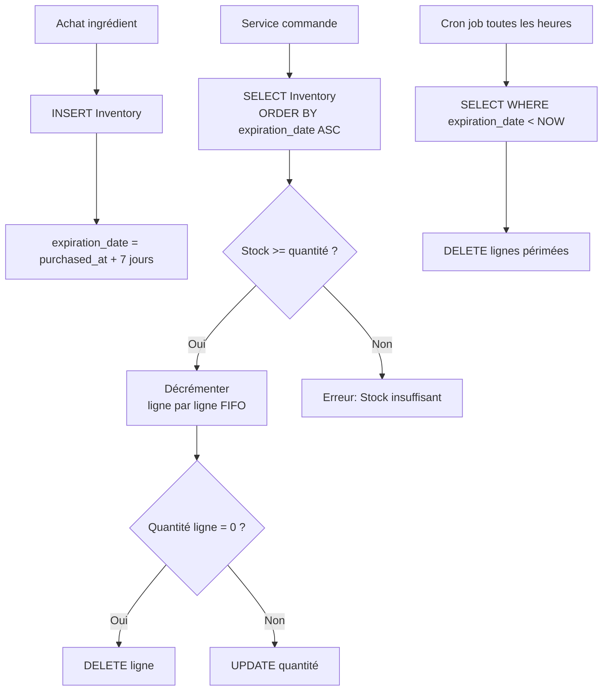
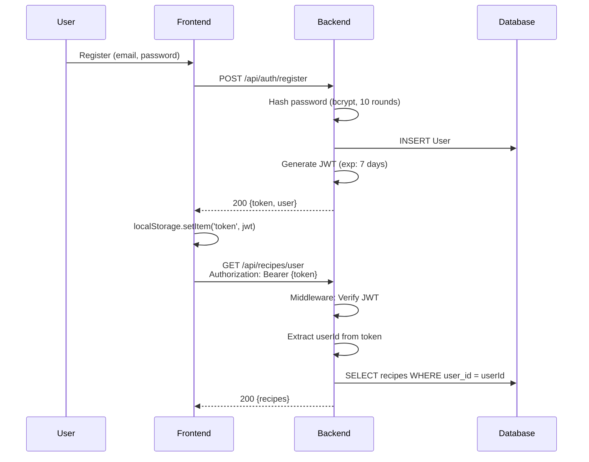
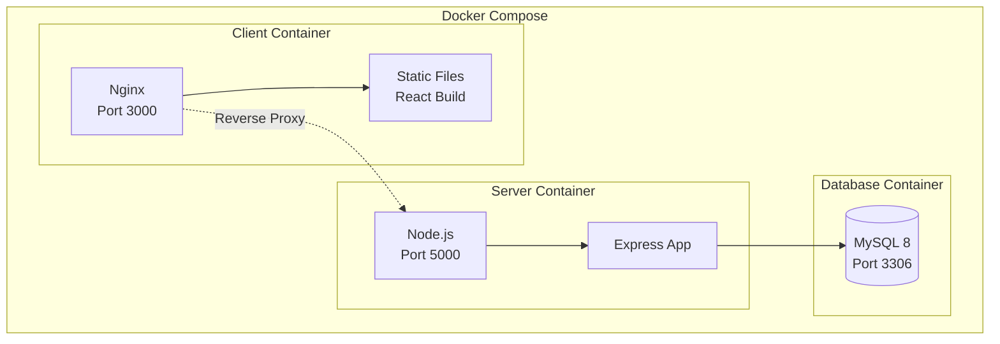

# 🏗️ ARCHITECTURE - GastroChef

**Version :** 1.0.0  
**Niveau atteint :** 18/20 (Chef Étoilé ⭐⭐⭐)

---

## 📋 Vue d'ensemble

**GastroChef** est une application fullstack de gestion de restaurant en temps réel avec :
- **Découverte de recettes** : Algorithme de matching d'ingrédients
- **Service temps réel** : WebSocket avec timer d'expiration
- **Gestion financière** : Trésorerie, achats, stocks FIFO

**Architecture :** Client-Server avec HTTP REST + WebSocket bidirectionnel

---

## 🛠️ Stack Technique



---

## 🏗️ Architecture Globale



**Flux de données :**
1. **HTTP** : Authentification, CRUD (recettes, commandes, marketplace)
2. **WebSocket** : Commandes temps réel, mises à jour stats
3. **Cron** : Suppression automatique des produits périmés (toutes les heures)

---

## 🗄️ Base de Données

### Modèle Conceptuel de Données (MCD)



### Tables Principales

| Table                    | Description                          | Points Clés                              |
| ------------------------ | ------------------------------------ | ---------------------------------------- |
| `users`                  | Comptes joueurs                      | treasury, satisfaction, stars            |
| `recipes`                | Recettes découvrables                | sale_price                               |
| `ingredients`            | Ingrédients achetables               | price                                    |
| `orders`                 | Commandes clients                    | expires_at, is_vip, status               |
| `inventory`              | Stocks joueurs (FIFO)                | expiration_date, quantity                |
| `transactions`           | Historique financier                 | type, amount, balance_after              |
| `recipe_ingredients`     | Composition des recettes             | Many-to-Many (recipe ↔ ingredient)       |
| `user_discovered_recipes`| Recettes débloquées par joueur       | Contrainte UNIQUE (user_id, recipe_id)   |

### Index Critiques

```sql
-- FIFO : Tri par date d'expiration
CREATE INDEX idx_inventory_fifo 
ON inventory(user_id, ingredient_id, expiration_date);

-- Cron : Recherche des produits périmés
CREATE INDEX idx_inventory_expiration 
ON inventory(expiration_date);

-- Orders : Lookup rapide
CREATE INDEX idx_orders_user_status 
ON orders(user_id, status);
```

---

## 🔄 Flux Applicatifs

### 1. Découverte de Recettes (Laboratoire)



**Points clés :**
- ✅ **Transaction atomique** (évite la race condition)
- ✅ Matching **EXACT** : même nombre d'ingrédients + mêmes IDs
- ✅ Contrainte **UNIQUE** en BDD : `(user_id, recipe_id)`

---

### 2. Service de Commandes (Temps Réel)



**Points clés :**
- ✅ **Transaction atomique** : Order + Inventory + User + Transaction
- ✅ **FIFO** : Consommation des stocks les plus anciens
- ✅ **WebSocket bidirectionnel** : Serveur → Client (new_order) et Client → Serveur (serve)

---

### 3. Système FIFO (Gestion DLC)



**Exemple FIFO :**
```sql
-- Achats
INSERT INTO inventory VALUES (user_id=1, ingredient_id=3, quantity=5, expiration_date='2026-02-20');
INSERT INTO inventory VALUES (user_id=1, ingredient_id=3, quantity=3, expiration_date='2026-02-22');

-- Service (besoin de 6 unités)
1. Consommer 5 unités de la ligne 1 (2026-02-20) → DELETE ligne 1
2. Consommer 1 unité de la ligne 2 (2026-02-22) → UPDATE quantity=2
```

---

## 🔌 Architecture API

### Routes Principales

```
/api
├── /auth
│   ├── POST /register          # Inscription + token JWT
│   └── POST /login             # Connexion + token JWT
│
├── /recipes
│   ├── GET /                   # Toutes les recettes
│   └── GET /user               # Recettes découvertes [JWT]
│
├── /laboratory
│   └── POST /experiment        # Tester combinaison [JWT]
│
├── /orders
│   ├── GET /                   # Commandes pending [JWT]
│   ├── POST /serve/:id         # Servir commande [JWT]
│   └── POST /cleanup-expired   # Nettoyer expirées [JWT]
│
├── /marketplace
│   ├── GET /ingredients        # Liste + prix [JWT]
│   ├── POST /buy               # Acheter [JWT]
│   └── GET /inventory          # Stock [JWT]
│
└── /dashboard
    ├── GET /stats              # KPIs [JWT]
    ├── GET /transactions       # Historique [JWT]
    └── GET /charts             # Données graphiques [JWT]
```

### Middleware Auth

```typescript
// authMiddleware.ts
export const authMiddleware = (req: AuthRequest, res: Response, next: NextFunction) => {
  const token = req.headers.authorization?.split(' ')[1];
  if (!token) return res.status(401).json({ message: 'Missing token' });
  
  try {
    const decoded = jwt.verify(token, process.env.JWT_SECRET) as { id: number };
    req.userId = decoded.id;
    next();
  } catch {
    return res.status(401).json({ message: 'Invalid token' });
  }
};
```

---

## 🔌 Architecture WebSocket

### Événements Socket.io

```mermaid
graph LR
    subgraph "Client"
        C[React App]
    end
    
    subgraph "Server"
        S[Socket.io Server]
    end
    
    C -->|CONNECT auth:{token}| S
    S -->|EVENT connected| C
    
    C -->|EMIT join_game userId| S
    S -->|socket.join room| S
    
    S -->|EMIT new_order| C
    S -->|EMIT order_expired| C
    S -->|EMIT stats_update| C
    S -->|EMIT game_over| C
```

| Événement       | Direction       | Payload                                | Description                 |
| --------------- | --------------- | -------------------------------------- | --------------------------- |
| `connected`     | Server → Client | `{userId, socketId, room}`             | Confirmation connexion      |
| `new_order`     | Server → Client | `{orderId, recipe, expires_at, is_vip}`| Nouvelle commande           |
| `order_expired` | Server → Client | `{orderId, satisfaction}`              | Commande expirée            |
| `stats_update`  | Server → Client | `{satisfaction, treasury, stars}`      | Mise à jour stats           |
| `game_over`     | Server → Client | `{reason: 'satisfaction'|'treasury'|'stars'}` | Game Over        |

**Rooms :** Chaque utilisateur est dans une room `user:${userId}` pour l'isolation des événements.

---

## 🔐 Sécurité

### Authentification JWT



**Points clés :**
- ✅ Password haché avec **bcrypt** (10 rounds)
- ✅ Token JWT généré immédiatement (auto-login)
- ✅ JWT_SECRET minimum **32 caractères** (vérification au démarrage)
- ✅ Middleware vérifie le token sur chaque route protégée

---

## 🐳 Déploiement Docker

### Architecture Docker Compose



### Multi-stage Build

**Backend :**
```dockerfile
FROM node:18-alpine
WORKDIR /app
COPY package*.json ./
RUN npm ci
COPY . .
RUN npm run build
CMD ["node", "dist/app.js"]
```

**Frontend :**
```dockerfile
# Stage 1: Build
FROM node:18-alpine AS builder
WORKDIR /app
RUN npm ci && npm run build

# Stage 2: Production
FROM nginx:alpine
COPY --from=builder /app/dist /usr/share/nginx/html
COPY nginx.conf /etc/nginx/conf.d/default.conf
```

**Avantages :**
- ✅ Images légères (~200 MB total avec Alpine)
- ✅ Séparation build/runtime
- ✅ Cache des layers npm

---

## 🎯 Choix Techniques Justifiés

### Pourquoi MySQL (vs MongoDB) ?

**✅ Avantages :**
- Relations complexes (Many-to-Many : Recipe ↔ Ingredient)
- Transactions ACID nécessaires (service de commande = 4 opérations atomiques)
- Contraintes d'intégrité (UNIQUE, FOREIGN KEY)

**❌ MongoDB aurait posé problème pour :**
- Transactions multi-collections
- Garanties d'intégrité référentielle

---

### Pourquoi Sequelize (vs Prisma) ?

**✅ Avantages :**
- Support natif MySQL mature
- `.sync()` automatique en développement
- Syntaxe simple pour les débutants

**❌ Inconvénients :**
- Type safety moins stricte que Prisma
- Syntaxe plus verbeuse

**Verdict :** Meilleur pour un projet pédagogique avec MySQL.

---

### Pourquoi Socket.io (vs WebSocket natif) ?

**✅ Avantages :**
- Reconnexion automatique
- Rooms natives (isolation par user)
- Fallback HTTP long-polling
- API simple et stable

**Verdict :** Plus robuste que WebSocket natif pour du temps réel production-ready.

---

### Pourquoi Transactions Atomiques ?

**Problème :** Service d'une commande = 4 opérations :
1. UPDATE Order (status = served)
2. UPDATE Inventory (FIFO)
3. UPDATE User (satisfaction, treasury)
4. INSERT Transaction

**Risque :** Si l'étape 2 échoue, la commande est marquée servie mais le stock n'est pas déduit → incohérence.

**Solution :** Transaction Sequelize :
```typescript
const transaction = await sequelize.transaction();
try {
  // 4 opérations
  await transaction.commit();
} catch (err) {
  await transaction.rollback();
  throw err;
}
```

---

## 📊 Métriques

| Métrique                  | Valeur          |
| ------------------------- | --------------- |
| **Tables BDD**            | 8               |
| **Endpoints API**         | 15              |
| **Événements WebSocket**  | 5               |
| **Pages Frontend**        | 10              |
| **Composants React**      | 12              |
| **Lignes de code**        | ~8000           |
| **Temps moyen requête**   | < 100ms         |
| **Taille image Docker**   | ~200 MB (Alpine)|

---

## 🚀 Améliorations Futures

**Performance :**
- [ ] Redis pour le cache (recettes, ingrédients)
- [ ] Pagination API (liste transactions)

**Sécurité :**
- [ ] Rate limiting (express-rate-limit)
- [ ] Helmet.js (headers HTTP)

**Monitoring :**
- [ ] Logs centralisés (Winston)
- [ ] Sentry (tracking erreurs)

---

**Fin du document** 🏗️
